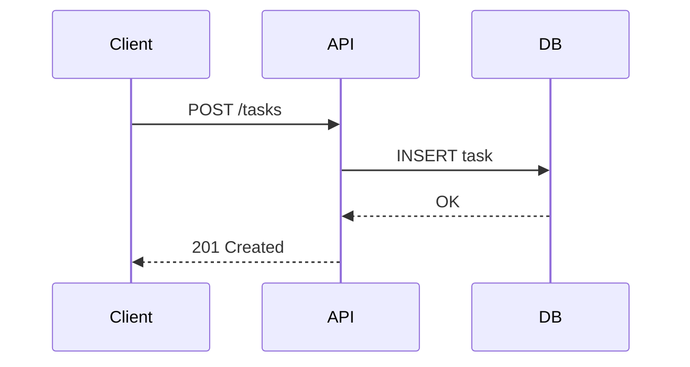
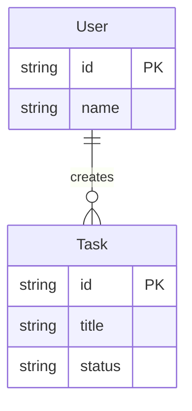
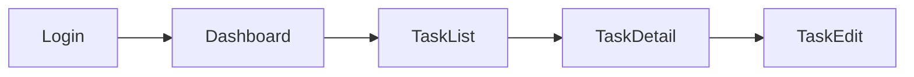

# /learn-ce-dd — 設計ドキュメント作成（02-03）

設計ドキュメント（DD）を `add_design_doc` で作成する演習です。Mermaid 図を含みます。

**所要時間**: 約 90 分
**前提**: `/learn-ce-design`（02-02）完了推奨
**スキル対応**: Context Engineering（情報環境の設計）

---

## Step 1: DD とは何かの説明

```
「DD（設計ドキュメント）は『今どうなっているか』の正です。
DR（意思決定記録）が『なぜそうなったか』なら、DD は『何を作るか』の仕様書です。

DD と DR の違い:
- DD = 現行仕様（開発の第一参照先）
- DR = 意思決定の経緯（経緯を辿る時に参照）

DD には代替案は書きません。代替案は DR に記録します。
DD には『関連する DR へのリンク』を書くことで、なぜその設計になったかを辿れるようにします。」
```

DD-#74（ProjSight プロダクトビジョン）を `get_dr` で取得し、実際の DD の例として構造を見せる。

続けて `list_drs(type='design')` で小規模な DD（機能単位）を探し、1 つ取得して見せる。DD-#74 はプロダクト全体のビジョンだが、受講者がこれから書く DD はこちらの規模感に近いことを伝える:

```
「DD-#74 はプロダクト全体のビジョンなので大きめですが、
普段書く DD はもっと小さいものが多いです。
こちらの DD を見てください — 1 つの機能や仕組みに絞った設計ドキュメントです。
今回書くのはこのくらいの規模感です。」
```

---

## Step 2: テーマ選択

### 02-02 完了済みの場合

02-02 で設計したプロジェクトの一部機能について DD を書く。`list_projects` で受講者の学習プロジェクトを確認し、テーマを選んでもらう:

- **A**: API 設計（エンドポイント、リクエスト/レスポンス形式）
- **B**: データモデル（テーブル設計、エンティティ関係）
- **C**: 画面遷移（ページ構成、ナビゲーション）
- **D**: 自由テーマ

### 02-02 未完了の場合

02-02 が未完了の場合は、以下のサンプルプロジェクトをテーマにする:

```
「02-02 がまだの場合でも大丈夫です。
TODO アプリ（タスクの CRUD + ユーザー認証）をテーマにして DD を書きましょう。
上の A〜C からテーマを選んでください。」
```

---

## Step 3: DD 作成ガイド

以下の構造で書くよう誘導する:

```markdown
# DD: {タイトル}

## 概要

<!-- 何を設計するか。第三者がこのセクションだけ読んで内容を把握できるように -->

## 背景

<!-- なぜこの設計が必要か -->

## 設計

<!-- 本体。テーブル、フロー図、API 仕様等 -->

### Mermaid 図

<!-- 最低 1 つ。flowchart, sequenceDiagram, erDiagram のいずれか -->

## 制約・前提

<!-- 技術的・ビジネス的な制約 -->

## 関連する意思決定

<!-- この設計に至った DR（意思決定記録）へのリンク。例: 「DR-#12 で DynamoDB を選定」 -->
<!-- まだ DR がない場合は「なし（今後 /learn-ie-write で DR を書く際にリンクする）」と記載 -->
```

> **なぜ「代替案」ではなく「関連する意思決定」か？**
> 代替案（何を検討して何を却下したか）は DR に書くものです。DD は「今どうなっているか」の仕様書なので、代替案は書きません。代わりに、関連する DR へのリンクを置くことで、経緯を辿れるようにします。

### Mermaid 図のガイド

受講者のテーマに応じて適切な図の種類を提案する:

| テーマ           | 図の種類          | 用途                        |
| ---------------- | ----------------- | --------------------------- |
| **API 設計**     | `sequenceDiagram` | リクエスト/レスポンスフロー |
| **データモデル** | `erDiagram`       | エンティティ関係図          |
| **画面遷移**     | `flowchart`       | ページ遷移図                |

以下のミニマルスニペットをコピペの出発点として提供し、受講者のテーマに合わせて編集を支援する:

**sequenceDiagram（API 設計向け）**:

````markdown

````

**erDiagram（データモデル向け）**:

````markdown

````

**flowchart（画面遷移向け）**:

````markdown

````

### Mermaid 図のプレビュー方法

```
「書いた Mermaid 図は以下の方法でプレビューできます:
- VS Code: 拡張機能『Markdown Preview Mermaid Support』をインストール → .md ファイルのプレビューで表示
- ブラウザ: mermaid.live にアクセスしてコードを貼り付け
- ProjSight Web UI: 登録後に DD を開くと自動レンダリングされます」
```

---

## Step 4: add_design_doc で登録

受講者が DD を書き終えたら、`add_design_doc` で ProjSight に登録する。

**実行の流れ**: 受講者がタイトルと本文（Markdown）を決め、ガイドが `add_design_doc(projectId, title, body)` を実行する。

- `projectId`: 受講者の学習プロジェクト ID
- `title`: DD のタイトル（例: 「TODO アプリ API 設計」）
- `body`: 受講者が書いた DD 本文（Markdown 全文）

登録後、DD 番号を伝える。

### （任意）Web UI で確認

```
「登録した DD を Web UI（projsight.com）で開いてみましょう。
Mermaid 図が正しくレンダリングされているか確認できます。
実際の見た目を確認することで、チームメンバーにどう見えるかがわかります。」
```

---

## Step 5: DD セルフレビュー

登録した DD をガイド AI がレビューし、フィードバックを返す。

### レビュー観点

1. **構造の網羅性**: 各セクション（概要・背景・設計・制約・関連する意思決定）が埋まっているか
2. **概要の明瞭さ**: 「概要」セクションだけで、何を設計しているか第三者に伝わるか
3. **Mermaid 図の構文**: 構文エラーがないか、図の内容が設計と一致しているか
4. **DD/DR の役割分担**: DD に「なぜ」が混入していないか（「なぜ」は DR に書くべき）

### フィードバックの流れ

```
「登録した DD をレビューしますね。」
```

`get_dr` で登録済みの DD を取得し、上記 4 観点でチェックする。改善ポイントを **1〜3 個** に絞って提示する:

```
「レビュー結果です:
✅ [良い点を 1〜2 個]
📝 改善ポイント:
1. ...
2. ...

修正してみますか？修正したい場合は内容を教えてください。
そのまま進む場合は『OK』と言ってください。」
```

受講者が修正を希望した場合、修正内容を反映して `upsert_dr(drId, body)` で DD を更新する。

---

## Step 6: 振り返り

```
「DD を書くことで、実装前に設計を言語化する習慣が身につきます。
AI にこの DD を渡せば、あなたの意図通りに実装してくれます。

ポイント:
- Mermaid 図は ProjSight の Web UI でレンダリングされる
- DD は『生きたドキュメント』— コードと一緒に更新する
- 代替案は DR に書き、DD には関連 DR へのリンクを置く
- 次の /learn-ce-maintain では、DD の更新判断と実施を体験します」
```

受講者のタスクを `complete_work(taskId)` で完了にする。
