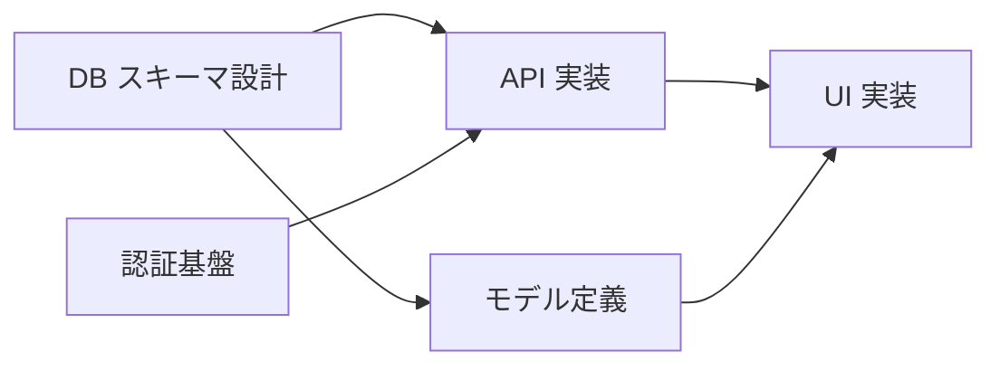

# /learn-se-dependency — タスク依存関係（04-04）

タスク間の依存関係を `create_link` で記録し、ブロッカー警告を体験する演習です。

**所要時間**: 約 45 分
**前提**: `/learn-se-risk`（04-03）完了済み
**スキル対応**: Specification Engineering（自律実行できる仕様）

---

## Step 1: 導入

```
「タスクの順序を明示することで、AI もチームも『次に何をすべきか』を判断できます。

依存関係の基本:
- A blocks B = 『A が完了しないと B に着手できない』
- 依存関係を明示すると、並列実行できるタスクも明確になる
- AI エージェントが複数タスクを効率的に処理するための重要な情報

依存関係が暗黙のままだと:
- 順序を間違えて手戻りが発生する
- 並列にできるタスクを直列に処理してしまう
- ブロッカーに気づくのが遅れる」
```

---

## Step 2: 依存関係の分析

04-01 のタスク一覧を `list_tasks` で確認する。

```
「あなたのタスク一覧を見てください。
以下の観点で依存関係を考えましょう:

- どのタスクがどのタスクの前提になるか？
- 並列に実行できるタスクはどれか？
- ボトルネック（多くのタスクがブロックされる）になるタスクはどれか？」
```

受講者に依存関係を考えてもらい、Mermaid の依存関係図を一緒に作成する:



---

## Step 3: create_link で記録

依存関係を `create_link` で登録する。

- 2〜3 件の依存関係を作成
- `source` がブロックする側、`target` がブロックされる側

```
「blocks リンクの方向に注意してください:
  create_link(
    sourceType='task', sourceId=A,
    targetType='task', targetId=B,
    linkType='blocks'
  )
  → 『A が B をブロックする』= 『A が完了しないと B に着手できない』

  パラメータ:
  - sourceType / targetType: エンティティの種類（task, issue, risk 等）
  - sourceId / targetId: エンティティの UUID
  - linkType: blocks, resolves, mitigates, implements, caused_by, related」
```

登録後、`list_links` で依存関係が正しく記録されたことを確認する。

---

## Step 4: ブロッカー警告の体験

ブロックされているタスク（前提タスクが未完了のもの）を `start_work` で開始してみる。

```
「start_work のレスポンスを見てください。
ブロッカー警告が含まれているはずです。

この警告があるから:
- 順序を間違えずに着手できる
- AI エージェントも『このタスクはまだ早い』と判断できる
- チームメンバーが間違った順序で作業を始めることを防げる」
```

- レスポンスに含まれるブロッカー情報を確認
- 「このタスクは A の完了後に着手すべき」という警告を理解してもらう

---

## Step 5: 振り返り

```
「依存関係管理のポイント:
- 依存関係を明示すると、並列実行できるタスクも見える
- AI エージェントが複数タスクを効率的に処理するための情報になる
- ブロッカー警告が『順序の間違い』を自動で検出する
- ボトルネックタスクを早期に特定し、優先的に着手できる

Specification Engineering では、タスクの内容だけでなく『順序と依存関係』も仕様の一部です。
AI に渡す仕様が完全であるほど、自律的な実行が可能になります。

次の /learn-se-issue では、バグ発見時の Issue ライフサイクルを体験します。」
```

受講者のタスクを `complete_work(taskId)` で完了にする。
