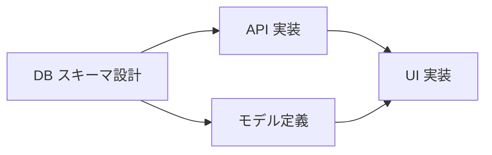

# /learn-se-dependency — タスク依存関係（04-04）

タスク間の依存関係を `create_link` で記録し、ブロッカー警告を体験する演習です。

**所要時間**: 約 45 分
**前提**: `/learn-se-risk`（04-03）完了済み
**スキル対応**: Specification Engineering（自律実行できる仕様）

---

## Step 1: 導入と現状確認

```
「タスクの順序を明示することで、AI もチームも『次に何をすべきか』を判断できます。

依存関係の基本:
- A blocks B = 『A が完了しないと B に着手できない』
- 依存関係を明示すると、並列実行できるタスクも明確になる

依存関係が暗黙のままだと、順序を間違えて手戻りが発生したり、ブロッカーに気づくのが遅れます。

まず、04-01 で作成したタスクの現状を確認しましょう。」
```

`list_tasks` を実行し、04-01 の成果物（deliverableId）に紐づくタスクを表示する。
各タスクの **タイトル**、**id（UUID）**、**status** の対応表を提示する。

**タスクの状態リセット**: 04-02 や 04-03 の演習でタスクが `in_progress` や `done` になっている場合があります。この演習では全タスクが `not_started` である必要があるため、該当するタスクがあれば `cancel_work` で `not_started` に戻してから進めてください。

```
例:
| # | タスク名           | id (UUID)                            | status      |
|---|--------------------|--------------------------------------|-------------|
| 1 | DB スキーマ設計     | a1b2c3d4-...                         | not_started |
| 2 | API 実装           | e5f6g7h8-...                         | not_started |
| 3 | モデル定義         | i9j0k1l2-...                         | not_started |
| 4 | UI 実装            | m3n4o5p6-...                         | not_started |
```

**タスクが 4 件未満の場合**: 依存関係の演習には最低 4 件のタスクが必要です。不足している場合は、以下のようなタスクを追加作成してください:

- **テスト作成** — API・モデルの単体テストとインテグレーションテストを実装する
- **ドキュメント作成** — API 仕様書や利用ガイドを作成する
- **環境構築** — CI/CD パイプラインやステージング環境をセットアップする

`upsert_task` で作成してから次へ進む。

---

## Step 2: 依存関係の分析

Step 1 で確認したタスク一覧をもとに、依存関係を分析する。

タスクごとに段階的に問いかける:

```
「それでは、タスクを 1 つずつ見ていきましょう。

1. 『API 実装』を始めるには、先にどのタスクが終わっている必要がありますか？
2. 『UI 実装』はどうでしょう？他のタスクの完了を待つ必要がありますか？
3. 『DB スキーマ設計』は、他のタスクに依存していますか？それとも最初に着手できますか？

この問いに答えることで、自然とタスク間の前後関係が見えてきます。」
```

受講者の回答をもとに、Mermaid の依存関係図を一緒に作成する:



```
「この図から読み取れること:
- DB スキーマ設計は他に依存がなく、最初に着手できる
- API 実装とモデル定義は DB スキーマ設計の完了を待つ必要がある
- UI 実装は API 実装とモデル定義の両方に依存している（最後に着手する）
- API 実装は複数のタスクにブロックされている（ボトルネック候補）」
```

---

## Step 3: create_link で記録

依存関係を `create_link` で登録する。

- 2〜3 件の依存関係を作成
- `source` がブロックする側、`target` がブロックされる側
- **覚え方: 「依存する側（後にやるタスク）= target」**。target は前提タスクの完了を待つ側です
- **この演習では `blocks` を使います**。他の linkType（resolves, mitigates 等）は 04-05（Issue 管理）で `resolves` リンクを使います

```
「blocks リンクの方向に注意してください:
  create_link(
    projectId=<projectId>,
    sourceType='task', sourceId=<タ��クAのUUID>,
    targetType='task', targetId=<タスクBのUUID>,
    linkType='blocks'
  )
  → 『A が B をブロックする』= 『A が完了しないと B に着手できない』
  → A = source（先にやるタスク）、B = target（後にやるタスク、依存する側）

  sourceId / targetId には、Step 1 の対応表で確認した各タスクの id（UUID）を指定します。
  例: sourceId='a1b2c3d4-...'、targetId='e5f6g7h8-...'」
```

登録後、`list_links` で依存関係が正しく記録されたことを確認する。

**方向を間違えた場合のリカバリ**: source と target を逆に登録してしまった場合は、`remove_link` で削除してから正しい方向で再登録してください。

```
例:
  remove_link(
    projectId=<projectId>,
    linkId=<list_links で確認した誤ったリンクの UUID>
  )
  → 削除後、source と target を入れ替えて create_link をやり直す
```

---

## Step 4: ブロッカー警告の体験

Step 3 で登録した依存関係の **target 側**（ブロックされる側＝依存する側）のタスクを `start_work` で開始してみる。
前提タスク（source 側）が未完了のため、ブロッカー警告が発生する。

> **重要**: source 側（ブロックする側）を `start_work` しても警告は出ません。必ず target 側を開始してください。

```
「start_work のレスポンスを確認してください。
blockers フィールドにブロッカー情報が含まれています。」
```

レスポンスに含まれるブロッカー情報の例:

```json
{
  "task": { "id": "...", "status": "in_progress", ... },
  "blockers": [
    {
      "taskId": "a1b2c3d4-...",
      "title": "DB スキーマ設計",
      "status": "not_started"
    }
  ],
  ...
}
```

**警告が出なかった場合**: 開始したタスクが source 側（ブロックする側）である可能性があります。Step 1 の対応表と Step 3 で登録したリンクの方向を確認し、target 側のタスクで再度試してください。

```
「ブロッカー警告のポイント:
- 警告が出ても、タスクは in_progress に遷移します（強制停止ではなく注意喚起）
- 警告を受けた場合の推奨アクション:
  1. `cancel_work` でこのタスクの開始を取り消す
  2. 前提タスク（source 側）を先に完了する
  3. その後で改めて `start_work` する

この警告があるから:
- 順序を間違えずに着手できる
- AI エージェントも『このタスクはまだ早い』と判断できる
- チームメンバーが間違った順序で作業を始めることを防げる」
```

ブロッカー警告を確認したら、`cancel_work` でタスクを元に戻す。
`cancel_work` 後、`list_tasks` でステータスが `not_started` に戻ったことを確認する。

---

## Step 5: 振り返り

```
「依存関係管理のポイント:
- 依存関係を明示すると、並列実行できるタスクも見える
- AI エージェントが複数タスクを効率的に処理するための情報になる
- ブロッカー警告が『順序の間違い』を自動で検出する
- ボトルネックタスクを早期に特定し、優先的に着手できる

Specification Engineering では、タスクの内容だけでなく『順序と依存関係』も仕様の一部です。
AI に渡す仕様が完全であるほど、自律的な実行が可能になります。

実プロジェクトでは、AI エージェントがタスク分解時に依存関係も自動提案します。この演習は依存関係の原理と方向の理解が目的です。

ここで振り返ってみましょう:
- 今回のタスクの中で、ボトルネックはどれでしたか？それはなぜですか？
- 実際のプロジェクトで、暗黙の依存関係になりがちなものにはどんなものがありますか？

次の /learn-se-issue では、バグ発見時の Issue ライフサイクルを体験します。」
```

受講者のタスクを `complete_work(taskId)` で完了にする。
