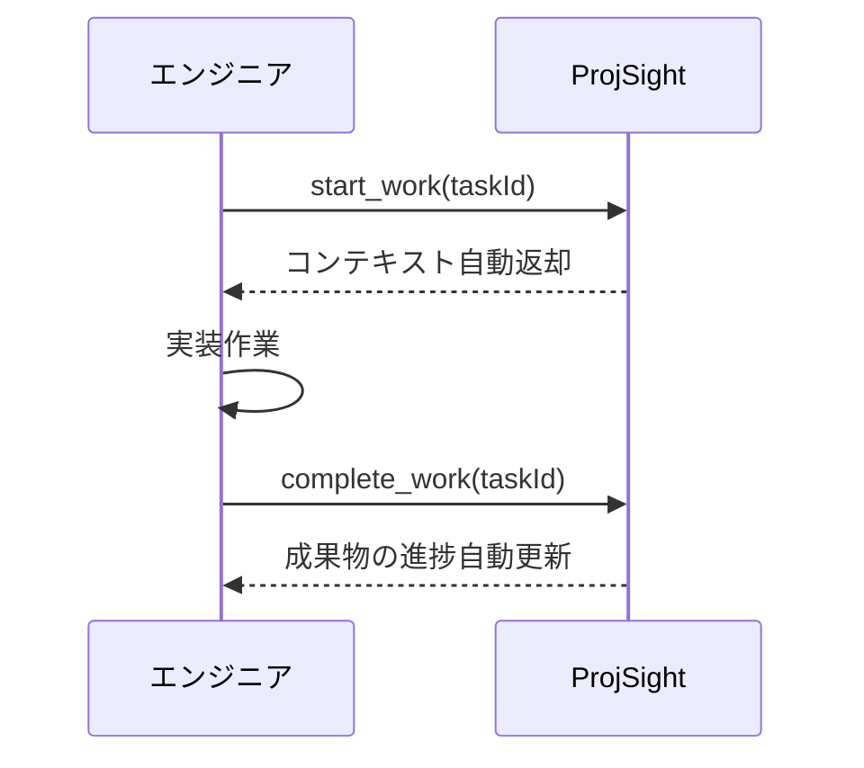

# /learn-se-workflow — start_work→complete_work 全フロー体験（04-02）

start_work → 実装 → complete_work の全フローを 2 タスク分体験する演習です。

**所要時間**: 約 90 分
**前提**: `/learn-se-decompose`（04-01）完了済み
**スキル対応**: Specification Engineering（自律実行できる仕様）

---

## Step 1: 導入

```
「AI 時代のプロジェクト管理では、作業の開始と完了を明示的に記録します。

ProjSight のワークフロー:
  start_work → コンテキスト取得 → 実装 → complete_work → 進捗自動計算

このサイクルを回すことで:
- AI は『今何をすべきか』を常に把握できる
- 中断しても、次のセッションで正確に再開できる
- 成果物の進捗が自動で更新される

今回は 04-01 で作成したタスクを使って、実際にこのフローを体験します。」
```



---

## Step 2: 1つ目のタスク実行

まず、04-01 で作成したタスクを確認する。

1. `list_tasks(projectId)` でタスク一覧を取得し、04-01 で作成したタスクの `taskId` を確認する
2. タスクを 1 つ選ぶ（依存関係がないものから選んでください。迷ったら一番シンプルなものを選べば OK）
3. `start_work(taskId)` で開始
4. レスポンスの `projectContext` を確認してもらう:
   - `activePhase` — 現在のフェーズ情報
   - `relatedDeliverable` — 紐づく成果物の状態
   - タスクの description に書いた背景・対応内容・完了条件

```
「start_work のレスポンスを見てください。
AI がタスクに着手するために必要な情報が全て揃っています。
これが Specification Engineering の成果です。」
```

5. 受講者に簡単な実装をしてもらう

> **この演習の目的はワークフローの体験です。** 実装の品質は問いません。ファイルを 1 つ作成する程度（README.md、設定ファイル等）で十分です。

6. 実装後 `complete_work(taskId)` で完了

---

## Step 3: 中断と再開の体験

2 つ目のタスクで「中断 → 再開」のシナリオを体験する。

1. `list_tasks(projectId)` で残りのタスクを確認し、もう 1 つ選ぶ
2. `start_work(taskId)` で開始
3. 途中まで作業を進める
4. 「ここで中断するとしたら？」というシナリオを提示

```
「実際の開発では、会議や別の緊急タスクで作業を中断することがよくあります。
中断時に何も記録しないと、再開時に『どこまでやったっけ？』から始まります。
ProjSight では notes に状態を記録します。」
```

5. `upsert_task(notes: '完了した作業・次にやるべきこと・未解決の問題')` で状態を記録

> **注意**: `start_work` は同一タスクに対して 1 回のみ実行可能です。2 回目を呼ぶとエラーになります。再開時は `start_work` を使わず、以下の手順で作業を再開してください。

6. 再開手順を体験する:
   1. `list_tasks(projectId, status: 'in_progress')` で作業中のタスクを見つける
   2. 該当タスクの `notes` と `description` を確認し、前回の状態を把握する
   3. notes に書いた「次にやるべきこと」から作業を再開する
7. 残りの作業を完了し、`complete_work(taskId)` で完了

---

## Step 4: deliverable 進捗の確認

`list_deliverables` で成果物の状態を確認する。

- `completionPct` が自動更新されていることを確認
- この値は完了タスク数 ÷ 全タスク数の均等配分で計算される

```
「complete_work を呼ぶだけで、成果物の進捗が自動計算されます。
手動で進捗率を更新する必要はありません。
これが『AI が入力、Web が出力』の ProjSight の設計思想です。」
```

---

## Step 5: 振り返り

```
「ワークフローのポイント:
- start_work はコンテキストを返す — AI は毎回『何をすべきか』を正確に把握できる
- notes は次のセッションへのバトン — 中断しても情報が失われない
- complete_work は進捗を自動計算 — 手動更新のコストがゼロ

このフローが習慣になれば、プロジェクトの状態は常に最新に保たれます。
チームメンバーや PO は Web UI を見るだけで進捗を把握できます。

次の /learn-se-risk では、実装中に潜むリスクを洗い出し、管理する方法を学びます。」
```

この演習の学習タスク（カリキュラム進捗管理用）を `complete_work(taskId)` で完了にする。
